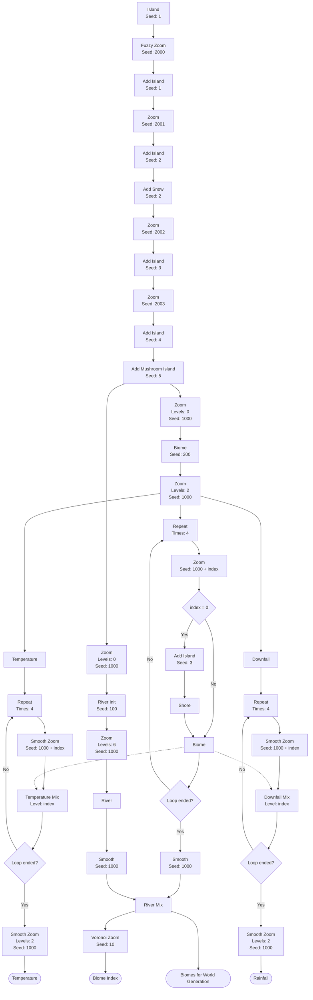

# GenLayer sequence *(b1.9-pre)*

## Preview

## Flow chart

```mermaid
flowchart TD
    island1["Island
    Seed: 1"]
    island1-->fuzzyZoom2000["Fuzzy Zoom
    Seed: 2000"]
    fuzzyZoom2000-->addIsland1["Add Island
    Seed: 1"]
    addIsland1-->zoom2001["Zoom
    Seed: 2001"]
    zoom2001-->addIsland2["Add Island
    Seed: 2"]
    addIsland2-->addSnow2["Add Snow
    Seed: 2"]
    addSnow2-->zoom2002["Zoom
    Seed: 2002"]
    zoom2002-->addIsland3["Add Island
    Seed: 3"]
    addIsland3-->zoom2003["Zoom
    Seed: 2003"]
    zoom2003-->addIsland4["Add Island
    Seed: 4"]
    addIsland4-->addMushroomIsland5["Add Mushroom Island
    Seed: 5"]

    addMushroomIsland5-->zoom1000x0["Zoom
    Levels: 0
    Seed: 1000"]
    zoom1000x0-->riverInit100["River Init
    Seed: 100"]
    riverInit100-->zoom1000x6["Zoom
    Levels: 6
    Seed: 1000"]
    zoom1000x6-->river["River"]
    river-->smooth1000["Smooth
    Seed: 1000"]

    addMushroomIsland5-->zoom1000x0_1["Zoom
    Levels: 0
    Seed: 1000"]
    zoom1000x0_1-->biome200["Biome
    Seed: 200"]
    biome200-->zoom1000x2["Zoom
    Levels: 2
    Seed: 1000"]
    zoom1000x2-->temperature["Temperature"]
    zoom1000x2-->downfall["Downfall"]

    zoom1000x2-->loop4["Repeat
    Times: 4"]
    loop4-->zoom1000i["Zoom
    Seed: 1000 + index"]
    zoom1000i-->ieq0{index = 0}
    ieq0-->|No|biomeStub
    ieq0-->|Yes|addIsland3_1["Add Island
    Seed: 3"]
    addIsland3_1-->shore["Shore"]
    shore-->biomeStub[Biome]
    biomeStub-->loop4repeat
    loop4repeat{Loop ended?}
    loop4repeat-->|No|loop4

    temperature-->temperatureLoop4["Repeat
    Times: 4"]
    temperatureLoop4-->smoothZoom1000i["Smooth Zoom
    Seed: 1000 + index"]
    smoothZoom1000i-->temperatureMix
    biomeStub-.->temperatureMix
    temperatureMix["Temperature Mix
    Level: index"]
    temperatureMix-->temperatureLoop4repeat
    temperatureLoop4repeat{Loop ended?}
    temperatureLoop4repeat-->|No|temperatureLoop4
    temperatureLoop4repeat--->|Yes|smoothZoom1000x2["Smooth Zoom
    Levels: 2
    Seed: 1000"]

    downfall-->downfallLoop4["Repeat
    Times: 4"]
    downfallLoop4-->smoothZoom1000i_1["Smooth Zoom
    Seed: 1000 + index"]
    smoothZoom1000i_1-->downfallMix
    biomeStub-.->downfallMix
    downfallMix["Downfall Mix
    Level: index"]
    downfallMix-->downfallLoop4repeat
    downfallLoop4repeat{Loop ended?}
    downfallLoop4repeat-->|No|downfallLoop4
    downfallLoop4repeat--->|Yes|smoothZoom1000x2_1["Smooth Zoom
    Levels: 2
    Seed: 1000"]

    loop4repeat-->|Yes|smooth1000_1["Smooth
    Seed: 1000"]
    smooth1000_1-->riverMix
    smooth1000-->riverMix
    riverMix["River Mix"]
    riverMix-->voroniZoom10["Voronoi Zoom
    Seed: 10"]
    riverMix--->output0(["Biomes for World Generation"])
    voroniZoom10-->output1(["Biome Index"])

    smoothZoom1000x2-->output2(["Temperature"])  
    smoothZoom1000x2_1-->output3(["Rainfall"])  
```
