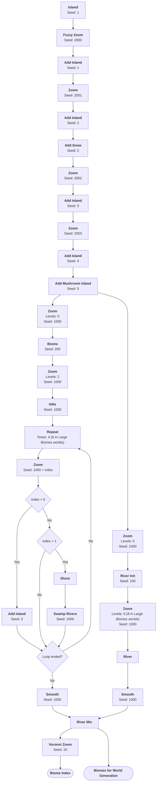

# GenLayer sequence *(1.2/12w03a+)*

```mermaid
flowchart TD
    island1["`**Island**
    Seed: 1`"]
    island1-->fuzzyZoom2000["`**Fuzzy Zoom**
    Seed: 2000`"]
    fuzzyZoom2000-->addIsland1["`**Add Island**
    Seed: 1`"]
    addIsland1-->zoom2001["`**Zoom**
    Seed: 2001`"]
    zoom2001-->addIsland2["`**Add Island**
    Seed: 2`"]
    addIsland2-->addSnow2["`**Add Snow**
    Seed: 2`"]
    addSnow2-->zoom2002["`**Zoom**
    Seed: 2002`"]
    zoom2002-->addIsland3["`**Add Island**
    Seed: 3`"]
    addIsland3-->zoom2003["`**Zoom**
    Seed: 2003`"]
    zoom2003-->addIsland4["`**Add Island**
    Seed: 4`"]
    addIsland4-->addMushroomIsland5["`**Add Mushroom Island**
    Seed: 5`"]

    addMushroomIsland5-->zoom1000x0["`**Zoom**
    Levels: 0
    Seed: 1000`"]
    zoom1000x0-->riverInit100["`**River Init**
    Seed: 100`"]
    riverInit100-->zoom1000x6["`**Zoom**
    Levels: 6 *(8 in Large Biomes worlds)*
    Seed: 1000`"]
    zoom1000x6-->river["`**River**`"]
    river-->smooth1000["`**Smooth**
    Seed: 1000`"]

    addMushroomIsland5-->zoom1000x0_1["`**Zoom**
    Levels: 0
    Seed: 1000`"]
    zoom1000x0_1-->biome200["`**Biome**
    Seed: 200`"]
    biome200-->zoom1000x2["`**Zoom**
    Levels: 2
    Seed: 1000`"]
    zoom1000x2-->hills1000["`**Hills**
    Seed: 1000`"]

    hills1000-->loop4["`**Repeat**
    Times: 4 (6 in Large Biomes worlds)`"]
    loop4-->zoom1000i["`**Zoom**
    Seed: 1000 + index`"]
    zoom1000i-->ieq0{index = 0}
    ieq0-->|No|ieq1{index = 1}
    ieq0-->|Yes|addIsland3_1["`**Add Island**
    Seed: 3`"]
    addIsland3_1-->loop4repeat
    ieq1-->|No|loop4repeat
    ieq1-->|Yes|shore["`**Shore**`"]
    shore-->swampRivers1000["`**Swamp Rivers**
    Seed: 1000`"]
    swampRivers1000-->loop4repeat
    loop4repeat{Loop ended?}
    loop4repeat-->|No|loop4

    loop4repeat-->|No|smooth1000_1["`**Smooth**
    Seed: 1000`"]
    smooth1000_1-->riverMix
    smooth1000-->riverMix
    riverMix["`**River Mix**`"]
    riverMix-->voroniZoom10["`**Voronoi Zoom**
    Seed: 10`"]
    riverMix--->output0(["`**Biomes for World Generation**`"])
    voroniZoom10-->output1(["`**Biome Index**`"])
```
